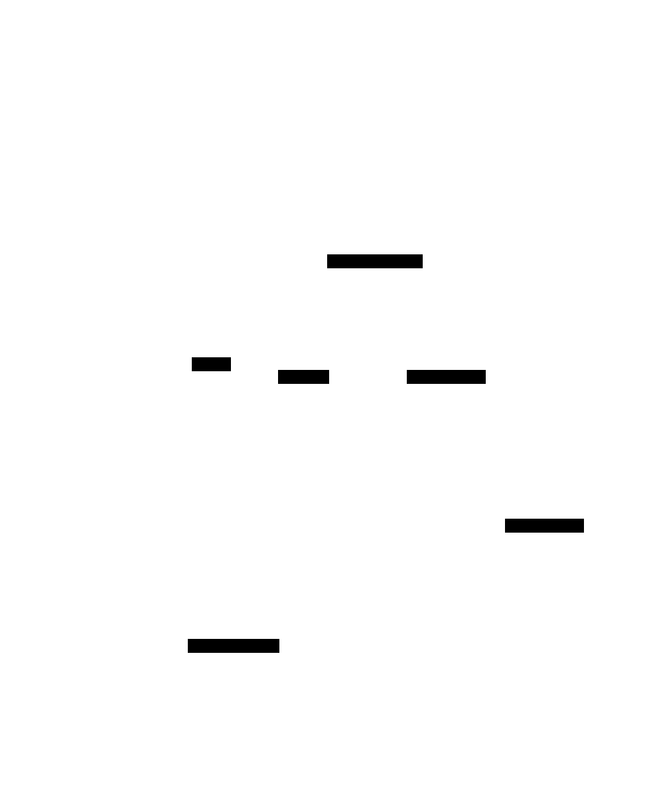

# Project Data Engineering: Sensor Data Stream Processing Pipeline

## Background and Concept
The municipality has installed various sensors capable of sending near real-time measurements of environmental metrics. The ultimate goal is to achieve a high-resolution sensor coverage of the city and protect citizens from increasingly frequent extreme weather events such as periods of extreme heat. The heterogeneous local conditions within the urban area — such as highly sealed surfaces versus green spaces — should be accurately reflected in the sensor network. Accurate and high-resolution measurements of urban climate and air quality contribute to the identification of local hotspot areas and can be integrated into urban planning processes. They provide a basis for structural measures such as facade greening, de-sealing of surfaces, or the implementation of shading structures. In addition, the data serve as input for urban weather models that enable precise and highly localized forecasts. This allows, for example, the generation of localized heat warnings during heatwaves as well as the recommendation of alternative routes through the city.  
  
To model a near real-time weather and air quality data stream, I use the Weather Forecast API and the Air Quality API of the openly available weather data API Open-Meteo. To simulate multiple sensors throughout a city, I initially sample 45 locations within a specified city, and pull data for all locations from both APIs every 15 minutes in a time-shifted manner, resulting in one data entry every ten seconds. According to the documentation, both APIs support current condition requests based on 15-minutely weather model data. However, I have observed that the reported "current conditions" are updated at intervals ranging from 15 to 60 minutes, which may result in duplicated entries in the incoming data.  
To simulate a first weather model developed on the basis of the collected sensor data, I use the Weather Forecast API to pull daily forecasts. Weather warnings could be triggered on a daily basis for the subsequent day. In later stages of development, forecasts may be updated in near real-time. To ensure that alerts are triggered only once in this scenario, the timestamp of the last issued warning could be stored and an all-clear notification could be published once conditions fall below the defined thresholds.  
  
Here is a list of all exemplary measurement categories used in my implementation:  

Sensor information:
- sensor id (integer)
- longitude (float)
- latitude (float)
- elevation (float)

Weather:
- date and time (UTC+0)
- temperature at 2m (float)
- relative humidity at 2m (float)
- apparent temperature (float)
- is day (boolean)
- precipitation (float)
- rain (float)
- snowfall (float)
- surface pressure (float)
- wind speed at 10m (float)
- wind direction at 10m (float)
- wind gusts at 10m (float)

Air Quality:
- date and time (UTC+0)
- PM_10 (float)
- PM_2 5 (float)
- carbon monoxide (float)
- nitrogen dioxide (float)
- sulphur dioxide (float)
- ozone (float)
- dust (float)
- uv index (float)

Daily weather forecast:
- date and time (UTC+0)
- maximum temperature at 2m (float)
- minimum temperature at 2m (float)
- maximum apparent temperature (float)
- minimum apparent temperature (float)
- rain sum (float)
- snowfall sum (float)
- precipitation sum (float)
- precipitation hours (float)
- maximum wind speed at 10m (float)
- maximum wind gusts at 10m (float)
  
## Technical approach

Data processing is done via Kafka to provide fault tolerance and scalability. The sensor data are stored in a PostgreSQL database, since the structure of the retrieved data is known. Since the weather model is still under development, the structure of the forecasts and the derived warnings has not been fully defined yet and a MongoDB database is employed for storage. To minimize the dependencies of the local system, I use Podman to load and run containers containing instances from Docker Hub. Podman provides a Docker-compatible, daemonless, and rootless alternative to Docker, enhancing security and reducing system overhead while maintaining a familiar workflow. Kafka, PostgreSQL and MongoDB all run in separate containers to ensure maintainability and reliability. Also, each script pushing data to a Kafka producer or pulling data from a Kafka consumer runs in its own container to achieve as much isolation and resilience as possible. 
  
The system is implemented as a modular microservice architecture orchestrated via Podman/Docker Compose. This design improves maintainability by separating simulation logic, data ingestion, stream processing and data persistence. In principle, individual services can be developed, tested, and updated independently without affecting the rest of the system. Minimal containerized environments prevent version conflicts and simplify reproducibility across systems while reducing memory requirements and attack surface. Persistent data is managed through volumes, ensuring that the application layer remains stateless and containers can be safely recreated or replaced. Service dependencies and startup order are managed via `depends_on` conditions to guarantee correct initialization sequencing. To ensure consistent startup conditions, short-lived initialization services create Kafka topics, database schemas, and indexes before the main services start.  
  
Scalability is primarily achieved through the use of Kafka as a central event streaming platform. By decoupling producers and consumers as well as partitioning Kafka topics, the system enables parallel processing of high-throughput data streams. Kafka supports horizontal scaling by adding more brokers to improve performance under full load. So, increased sensor density or higher data frequency are handled with minimal architectural changes. In addition, new sensors can be integrated into the system easily as the sensor data producer provides an HTTP interface, enabling straightforward connectivity. In case of excessive load, the processing of incoming sensor data can be distributed across multiple producers to maintain system performance.  
  
Kafka provides fault tolerance by storing records persistently and replicating them across multiple brokers. This ensures data durability and prevents message loss during processing. In this implementation, incoming messages are validated against strict schemas before being accepted, reducing the risk of malformed or inconsistent records. Consumers are designed to tolerate restarts and resume processing without manual intervention, while database operations are structured to avoid duplicate inserts where possible.  

## Implementation

The `kafka` container runs Apache Kafka and serves as the central messaging backbone of the system. Before any producers or consumers start, Kafka is initialized by the helper service `init_kafka` that creates three topics: weather, air_quality, and weather_forecast.

Data ingestion is handled by two producers. The `sensor_data_producer` exposes a FastAPI RESTful API that validates incoming JSON via Pydantic schemas and forwards messages to Kafka topics. The `sensor_stream_simulator` periodically generates realistic weather and air-quality measurements using the Open-Meteo API and sends them to the `sensor_data_producer`, mimicking IoT sensors. In parallel, the `forecast_producer` periodically fetches daily forecasts (including derived warning levels) and publishes them directly to Kafka.

The `postgres` container runs PostgreSQL and stores structured sensor data (weather and air quality). The initialization service `init_postgres` creates three tables: weather, air_quality, and a shared locations table. Two identical consumer services named `sensor_data_consumer1` and `sensor_data_consumer2` subscribe to the weather and air_quality topics respectively and insert the incoming data into the PostgreSQL database.

For storage of the semi-structured forecast data, the `mongodb` container runs a MongoDB instance. The `forecast_consumer` reads from the weather_forecast topic and stores each forecast document as JSON. Existing entries are replaced based on the sensor id, effectively maintaining the latest forecast per sensor and mimicking a simple real-time cache of current forecast states.



## How to run the project

```bash
git clone https://github.com/Qeexleef/Project-Data-Engineering-Sensor-Data-Stream-Processing-Pipeline.git
cd Project-Data-Engineering-Sensor-Data-Stream-Processing-Pipeline/

# login with your (free) Docker account to pull hardened Kafka image from dhi.io
podman login dhi.io

# start a Podman socket to enable Docker-compatible API for Podman Compose
systemctl --user start podman.socket
# verify the socket is active
systemctl --user status podman.socket

# run the application
podman compose up
# podman compose down

# alternative using Docker:
# docker login dhi.io
# docker compose up
```

## Personal reflection
During this project, I have learnt how to write Docker Compose files, including specifying dependencies between containers and defining persistent volumes. At the same time, I encountered practical limitations of container-based workflows with tools such as Docker and Podman: as the number of containers grows, configurations become increasingly complex and require more and more manual effort. This underscores the potential of more advanced orchestration and infrastructure tools such as Kubernetes and Terraform.

I observed the main difference between Docker and Podman in practice: A Docker Compose project cannot be built or started without a central service managing containers, whereas Podman operates daemonless. This issue is resolved by explicitly starting a Podman socket to provide a compatible interface.

Moreover, I gained experience in setting up PostgreSQL and MongoDB databases. Initial authentication issues with the PostgreSQL database occurred because the environment variable `POSTGRES_USER` had been changed while an outdated persistent volume with a differently named default database still existed. This inconsistency was resolved by removing the obsolete volume and rebuilding the project.  
During early testing, I also identified a data modeling issue. Using geographic coordinates (latitude and longitude as floating-point values) as keys proved to be unreliable due to rounding errors, which could lead to ambiguity or data corruption. Identification of the sensor location is addressed by introducing unique sensor identifiers as primary keys in both PostgreSQL and MongoDB, and storing the location to each sensor.

Overall, the project provided a foundation in containerized application design and implementation.